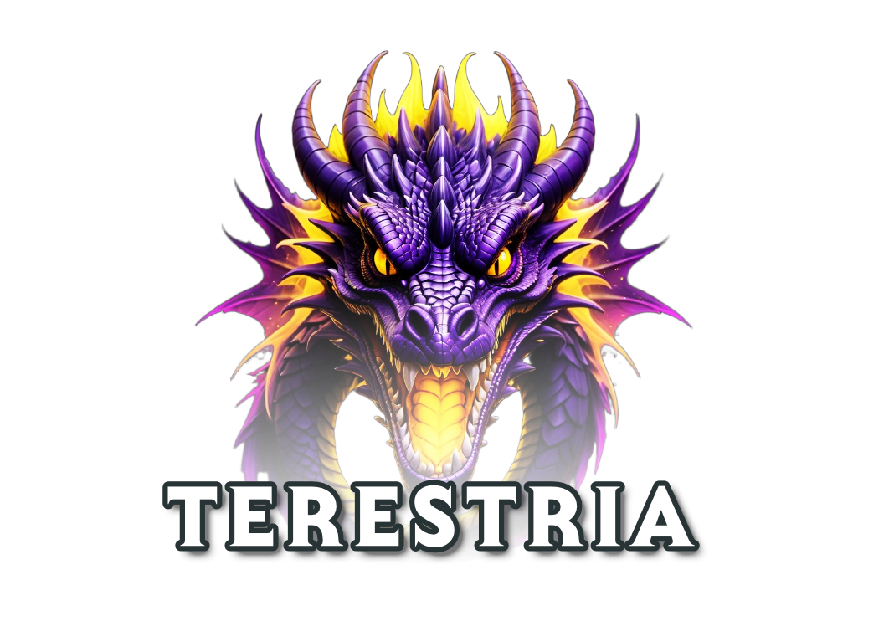

    

---

This is the client component of *Terestria*, a 2D game platform tailored for building and hosting small-scale online multiplayer role-playing games.

The client is built using the [Godot Engine](https://godotengine.org/).

## License

This project is licensed under the MIT License. For the complete license text, please refer to the [LICENSE](LICENSE) file.